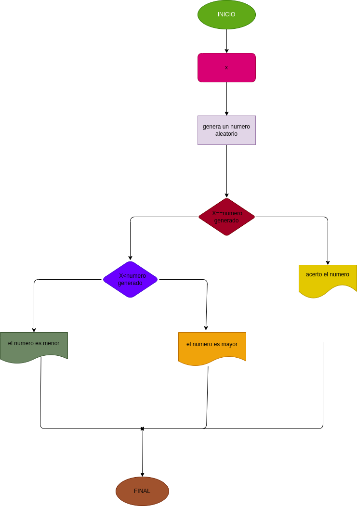

# adivina_el_numero Juego de adivinar un numero de 1 a 40 
juego de adivinar un nuero de 1 a 40

# ANALISIS
 variables de entrada 
 - numero_ingresado = ingrese un numero del 1 al 40
 
  varibles de proceso
- numero_aleatorio = genera un numero aleatorio entre 1 y 40
- saber si el numero ingresado es igual al numero aleatorio o el numero ingresado es mayor al numero aleatorio o el numero ingresado es menor al numero aleatorio 
   
variablesn de salida 
   
- el numero ingresado es igual al numero aleatorio o el numero ingresado es mayor al numero aleatorio o el numero ingresado es menor al numero aleatorio 
   
# DISEÑO 

   
# CONSTRUCCION 